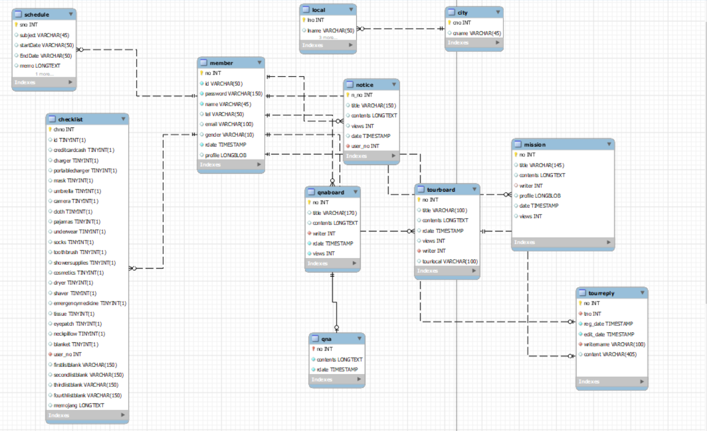

## 프로젝트 어디가지? [http://3.38.49.175:8080/prepare]

     [현재 1.0.0v은 강원도 -> 속초 지역만 이용 가능합니다 다른 지역은 추후 업데이트 예정입니다.]

✔️: 차례
- 어디가지?
  - [:mag_right: 개요](#mag_right-개요)
    - [:question: 기능](#question-기능)
    - [:computer: 개발환경](#computer-개발환경)
    - [:package: 패키지구조](#package-패키지구조)
    - [:file_cabinet: 테이블구조](#file_cabinet-테이블구조)

### :mag_right: 개요
    여행을 떠나고 싶지만 현재의 상황 때문에 가지 못하는 사람들,
    여행을 떠날때 일정이나 체크리스트를 작성해야 하는 부분,
    원하는 지역에 존재하는 카페나 맛집 등을 찾아봐야 할때
    이 모든 것들을 한 사이트 내에서 이루어지게 하고 싶었습니다.
    AWS의 EC2를 사용해서 서버를 구현해서 언제든지 접속가능 하도록 하였습니다.
    

#### :question: 기능
- :calendar: &nbsp;일정, 체크리스트
  - `일정 추가,삭제,상세보기`
  - `DatePicker를 이용한 편리한 gui사용`
  - `회원당 1개의 체크리스트를 DB에 저장`
  - `FullCalendar를 이용한 일정표`
  - `Ajax를 이용한 비동기 방식`
- :electric_plug: &nbsp;랜선투어
  - `게시글 작성,수정,삭제`
  - `Ajax를 이용한 댓글 기능`
  - `게시글 검색`
  - `자체 알고리즘을 통해 가장 많이 선택된 여행지를 메인페이지 하단에 배치`
- :mega: &nbsp;qna, 공지사항
  - `관리자, 이용자 기능분리`
  - `관리자 : 답글 기능, 공지사항 글쓰기`
- :sunny: &nbsp;날씨
  - `기상청 open API를 활용한 현재 날씨`
  - `json형식의 파일 수집`
  - `추후 미세먼지, 사용자 일정에 대한 날씨까지 보여줄 예정`    
- :airplane: &nbsp;호텔, 맛집, 카페, 관광지
  - `선택한 지역의 호텔, 맛집, 카페, 관광지`
  - `클릭시 해당 네이버 혹은 인스타 페이지로 이동`
- :family: &nbsp;회원
  - `회원가입시 이용가능한 서비스 제공`
  - `프로필 사진, 비밀번호 변경,탈퇴,찾기`
- :bell: &nbsp;미션
  - `매주 업데이트되는 지역미션을 통한 관광지활성화`
  - `해당 지역과의 협업 혹은 광고가능`
#### :computer: 개발환경
    
    Server OS : Linux(ubuntu)
    
    Language : JAVA 1.8
    
    Framework : Spring 5.0.2.RELEASE
    
    WEB Server : Apache
    
    WAS Server : Tomcat 8.5
    
    build tool : maven 3.6.3
    
    DB : MySQL 8.0.27
#### :package: 패키지구조
    com
     ㄴ stone
         ㄴ qnaboard
             ㄴ common
             ㄴ dataservice
             ㄴ presentation
             ㄴ service
         ㄴ loginOut
             ㄴ presentation
             ㄴ service
         ㄴ member
             ㄴ common
             ㄴ dataservice
             ㄴ presentation
             ㄴ service
         ㄴ mosttour
             ㄴ common
             ㄴ dataservice
             ㄴ presentation
             ㄴ service
         ㄴ notice
             ㄴ common
             ㄴ dataservice
             ㄴ presentation
             ㄴ service
         ㄴ replyboard
             ㄴ common
             ㄴ dataservice
             ㄴ service 
         ㄴ checklist
             ㄴ common
             ㄴ dataservice 
             ㄴ presentation
             ㄴ service
         ㄴ simple
             ㄴ common
             ㄴ dataservice
             ㄴ presentation
             ㄴ service
             ㄴ area
                 ㄴ common
         ㄴ schedule
             ㄴ common
             ㄴ dataservice
             ㄴ presentation
             ㄴ service
         ㄴ mission
             ㄴ common
             ㄴ dataservice
             ㄴ presentation
             ㄴ service
         ㄴ tour
             ㄴ common
             ㄴ dataservice
             ㄴ presentation
             ㄴ service
         ㄴ config
            
#### :file_cabinet: 테이블구조

